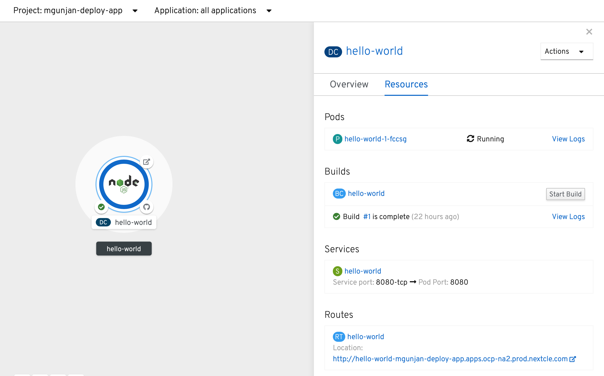
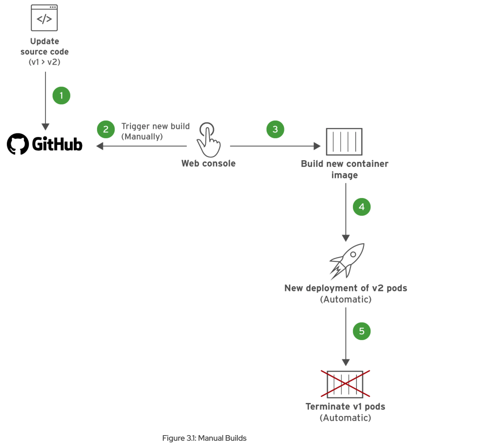
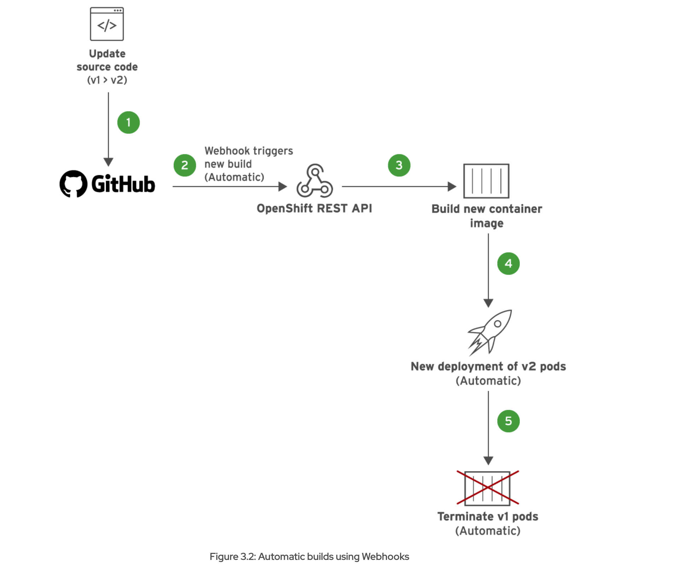

# Introduction

Red Hat OpenShift Container Platform is a containerized application platform that allows enterprises to accelerate and streamline application development, delivery, and deployment on-premise or in the cloud.
Course details: [Link](https://rol.redhat.com/rol/app/courses/do101-4.2/pages/pr01s02)

## Chapter 1. Configuring a Cloud Application Developer Environment

* Setup the workspace for "myapp" using VSCode
* Install node.js on the local machine

  ```
  brew install node
  ```

  **More about node.js:**
  * Node.js is an open source runtime engine that executes JavaScript outside of a browser. It is designed to efficiently handle many concurrent connections for network applications. Additionally, Node.js enables you to write both front end and back end code in one language, JavaScript. For these reasons, Node.js is a popular runtime engine for web application development.
  * Modules are the smallest unit of reusable code in Node.js. Node.js provides several built-in modules. You can also download and use third party Node.js modules.
  * A Node.js application dependency is called a package. A package is collection of one or more Node.js modules, or application code, that you download from a Node.js package repository.
  * The Node Package Manager (NPM) is a command line tool used to create, install, and publish Node.js packages.Express is a common Node.js framework that aims to simplify the creation of web services. Because Express is a Node.js package, use teh command below to install node.js
 
    ```
    npm install express
    ```
* Next, guide focus on Git setup and branching stategy from VSCode itself. 
  * Create new branch "devenv-versioning". Update DO101-apps/express-helloworld/app.js. T hen install application dependencies and execute the application
    ```
    npm install
    npm start
    ```
    In a browser, navigate to http://localhost:8080/. Verify that the application responds with a Hello World! message.
    In a browser, navigate to http://localhost:8080/mars. Verify that the application responds with a Hello Mars! message.

## Chapter 2. Deploying Applications to Red Hat OpenShift Container Platform

### OpenShift Container platform features for developers:

* Self-service platform where development teams can deploy their applications
* Platform integrates the tools to build and run applications, and manages the complete application life cycle from initial development to production
* Platform automatically retrieves the source code from Git, and then builds and deploys the application. The developer can also configure OpenShift to detect new Git commits, and then automatically rebuild and redeploy the application
* OpenShift provides the building mechanisms, libraries, and runtime environments for the most popular languages, such as Java, Ruby, Python, PHP, .NET, Node.js, and many more
* As traffic and load to your web application increases, OpenShift can rapidly provision and deploy new instances of the application components
* The web console provides a developer perspective for developers to create and manage their applications.
* A route resource associates a DNS host name to an application running in OpenShift


## Chapter 3. Configuring Application Builds in OpenShift

* Application build can be updated:
  * By manual trigger
  * By automatic trigger using webhook
* To deploy applications on OpenShift, you must create a container image. A container image is a binary package containing an application and all of its dependencies, including the operating system.
* In OpenShift, a build is the process of creating a runnable container image from application source code. A BuildConfig resource defines the entire build process.
* OpenShift can create container images from source code without the need for tools such as Docker or Podman. After they are built, application container images are stored and managed from a built-in container registry that comes bundled with the OpenShift platform.
* Source to Image (S2I) is Openshift supported build process where application source code is combined with an S2I builder image, which is a container image containing the tools, libraries, and frameworks required to run the application.

### Manual Trigger Build



### Automatic Build

* A Webhook is a mechanism to subscribe to events from a source code management system, such as GitHub.
* OpenShift generates unique webhook URLs for applications that are built from source stored in Git repositories. Webhooks are configured on a Git repository. Based on the webhook configuration, GitHub will send a HTTP POST request to the webhook URL, with details that include the latest commit information.
* The OpenShift REST API listens for webhook notifications at this URL, and then triggers a new build automatically. 




### Setting up Openshift CLI 

* Download and install openshift cli client
  [Openshift-Download](https://mirror.openshift.com/pub/openshift-v4/clients/ocp/latest/)
  ```
  $ sudo cp oc /usr/local/bin/
  $ sudo chmod +x /usr/local/bin/oc
  ```

* Check oc version

  ```
  $ oc version
  Client Version: 4.4.8
  ```

* Login to openshift cluster 
